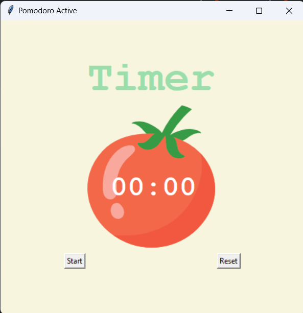

# POMODORA FOCUS

## Program-Code

```
from tkinter import *
# ---------------------------- CONSTANTS ------------------------------- #
PINK = "#e2979c"
RED = "#e7305b"
GREEN = "#9bdeac"
YELLOW = "#f7f5dd"
FONT_NAME = "Courier"
WORK_MIN = 25
SHORT_BREAK_MIN = 5
LONG_BREAK_MIN = 20
REPS = 0
timer = None

# ---------------------------- TIMER RESET ------------------------------- # 
def reset():
    global REPS
    REPS = 0
    window.after_cancel(timer)
    text.config(text="TIMER",fg=GREEN)
    canvas.itemconfigure(timer_text,text="00:00")
    tick_text.config(text="")
    
# ---------------------------- TIMER MECHANISM ------------------------------- # 

def show():
    global REPS
    REPS+=1
    work = WORK_MIN*60
    break_min = SHORT_BREAK_MIN*60
    long_break = LONG_BREAK_MIN*60
    
    if REPS%8==0:
        count_down(long_break)
        text.config(text="LONG BREAK",fg=RED)
    elif REPS%2==0:
        count_down(break_min)
        text.config(text="SHORT BREAK",fg=PINK)
    else:
        count_down(work)
        text.config(text="WORK SECTION",fg=GREEN)

# ---------------------------- COUNTDOWN MECHANISM ------------------------------- # 

def count_down(count):
    # global REPS
    count_min = count//60
    count_sec = count%60
    if count_sec<10:
        count_sec = f"0{count_sec}"
    canvas.itemconfig(timer_text,text=f"{count_min}:{count_sec}")
    
    if count>0:
        global timer
        timer = window.after(1,count_down,count-1)
    else:
        show()
        marks = ""
        work_session = REPS//2
        for _ in range(work_session):
            marks+="✔"
        tick_text.config(text=marks)
# ---------------------------- UI SETUP ------------------------------- #
window = Tk()
window.title("Pomodoro Active")
window.config(padx=100,pady=50,bg=YELLOW)


text = Label(text="Timer",fg=GREEN,bg=YELLOW,font=(FONT_NAME,50,"bold"))
text.grid(column=1,row=0)

canvas = Canvas(width=200,height=233,bg=YELLOW,highlightthickness=0)
photo = PhotoImage(file="tomato.png")
canvas.create_image(100,112,image=photo)
timer_text = canvas.create_text(103,130,text="00:00",fill="white",font=(FONT_NAME,34,"bold"))
canvas.grid(column=1,row=1)


start_text = Button(text="Start",highlightthickness=0,command=show)
start_text.grid(column=0,row=2)

reset_text = Button(text="Reset",highlightthickness=0,command=reset)
reset_text.grid(column=2,row=2)

tick_text = Label(fg=GREEN,bg=YELLOW)
tick_text.grid(column=1,row=3)

mainloop()

```

## Output


